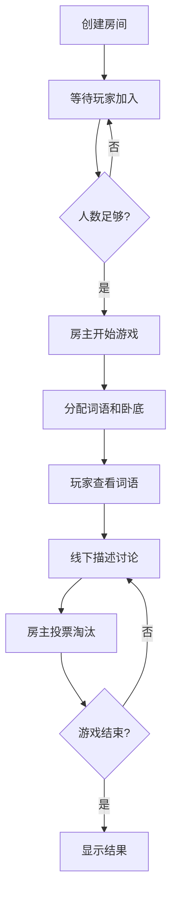

# 谁是卧底游戏项目 - AI 辅助开发提示词

## 项目概述

这是一个基于微信公众号的"谁是卧底"文字游戏，采用现代化的分层架构和面向对象设计。项目使用 Flask 作为 Web 框架，Redis 作为数据存储，支持 Docker 和 Kubernetes 部署。

## 核心技术栈

- **语言**: Python 3.11
- **Web 框架**: Flask 3.1.2
- **数据存储**: Redis 7.1.0
- **WSGI 服务器**: Gunicorn 23.0.0
- **容器化**: Docker + Docker Compose
- **编排**: Kubernetes (K3s)
- **反向代理**: Nginx
- **测试**: pytest + pytest-cov

## 架构设计原则

### 1. 分层架构

项目严格遵循分层架构设计，各层职责清晰：

```
表示层 (Presentation Layer)
  ↓
应用层 (Application Layer)
  ↓
领域层 (Domain Layer)
  ↓
基础设施层 (Infrastructure Layer)
```

#### 表示层
- **位置**: `src/main.py`, `src/app_factory.py`
- **职责**: HTTP 请求处理、路由分发、微信消息验证
- **关键组件**: Flask 应用、路由注册

#### 应用层
- **位置**: `src/services/`
- **职责**: 业务逻辑编排、用例协调、事务管理
- **关键组件**: 
  - `GameService`: 游戏核心逻辑
  - `MessageService`: 微信消息处理
  - `PushService`: 微信推送服务
  - `WeChatClient`: 微信 API 客户端

#### 领域层
- **位置**: `src/models/`
- **职责**: 业务实体定义、领域规则实现
- **关键组件**:
  - `Room`: 房间实体（状态、玩家、游戏数据）
  - `User`: 用户实体
  - `RoomStatus`: 房间状态枚举（WAITING, PLAYING, ENDED）

#### 基础设施层
- **位置**: `src/repositories/`, `src/utils/`, `src/config/`
- **职责**: 数据持久化、配置管理、工具类
- **关键组件**:
  - `RoomRepository`: 房间数据访问
  - `UserRepository`: 用户数据访问
  - `GameConfig`: 游戏配置
  - `WordGenerator`: 词语生成器

### 2. 设计模式应用

#### 工厂模式 (Factory Pattern)
- **实现**: `AppFactory` 类
- **用途**: 创建和配置 Flask 应用
- **优势**: 解耦应用创建过程，便于测试和配置管理

#### 仓储模式 (Repository Pattern)
- **实现**: `RoomRepository`, `UserRepository`
- **用途**: 抽象数据访问逻辑
- **优势**: 便于更换存储方案，隔离数据访问细节

#### 服务模式 (Service Pattern)
- **实现**: `GameService`, `MessageService`
- **用途**: 封装业务逻辑
- **优势**: 分离关注点，提高代码复用性

#### 状态机模式 (State Machine Pattern)
- **实现**: `GameStateMachine` (`src/fsm/game_state_machine.py`)
- **用途**: 管理游戏状态转换
- **状态**: WAITING → PLAYING → ENDED
- **事件**: CREATE, JOIN, START, VOTE, END

#### 策略模式 (Strategy Pattern)
- **实现**: `src/strategies/commands.py`
- **用途**: 命令处理策略
- **优势**: 灵活的命令扩展机制

### 3. 配置模式
- **实现**: `GameConfig`, `commands_config.py`
- **用途**: 集中管理游戏规则和命令配置
- **优势**: 统一配置管理，便于调整和维护

## 代码规范与最佳实践

### 1. Python 代码风格

```python
# 1. 使用类型提示
def create_room(self, user_id: str) -> Tuple[bool, str]:
    pass

# 2. 使用数据类 (dataclass)
@dataclass
class Room:
    room_id: str
    creator: str
    players: List[str] = field(default_factory=list)

# 3. 使用枚举类型
class RoomStatus(Enum):
    WAITING = "waiting"
    PLAYING = "playing"
    ENDED = "ended"

# 4. 文档字符串
def join_room(self, user_id: str, room_id: str) -> Tuple[bool, str]:
    """加入房间
    
    Args:
        user_id: 用户ID
        room_id: 房间号
        
    Returns:
        (成功标志, 消息)
    """
```

### 2. 文件组织规范

- **编码声明**: 所有 Python 文件以 `#!/usr/bin/env python3` 和 `# -*- coding: utf-8 -*-` 开头
- **模块文档**: 每个模块顶部包含三引号文档字符串说明模块用途
- **导入顺序**: 标准库 → 第三方库 → 本地模块
- **命名规范**:
  - 类名: PascalCase (`GameService`, `RoomRepository`)
  - 函数/方法: snake_case (`create_room`, `join_room`)
  - 常量: UPPER_SNAKE_CASE (`ROOM_TIMEOUT`)
  - 私有方法: 前缀下划线 (`_generate_unique_room_id`)

### 3. 数据持久化规范

#### Redis 数据结构
```python
# 房间数据: room:{room_id}
# 用户数据: user:{user_id}
# 过期时间: 使用 Redis 原生过期机制

# 示例
room_key = f"room:{room_id}"
redis_client.setex(room_key, ROOM_TIMEOUT, json.dumps(room.to_dict()))
```

#### 模型转换
- 所有模型必须实现 `to_dict()` 方法用于序列化
- 所有模型必须实现 `from_dict()` 类方法用于反序列化
- 时间字段使用 ISO 格式字符串存储

### 4. 错误处理规范

```python
# 1. 使用 Tuple[bool, str] 返回操作结果
def create_room(self, user_id: str) -> Tuple[bool, str]:
    try:
        # 业务逻辑
        return True, "创建成功"
    except Exception as e:
        return False, f"创建失败: {str(e)}"

# 2. 在服务层捕获异常，不向上抛出
# 3. 返回用户友好的错误消息
```

## 部署架构

### 1. Docker Compose 部署（开发环境）

```yaml
services:
  web:
    build: .
    ports:
      - "80:8000"
    environment:
      - REDIS_URL=redis://redis:6379/0
    depends_on:
      - redis
  
  redis:
    image: redis:alpine
    volumes:
      - redis-data:/data
  
  nginx:
    image: nginx:alpine
    ports:
      - "80:80"
    depends_on:
      - web
```

### 2. Kubernetes 部署（生产环境）

#### 资源配置规范
```yaml
# 所有容器必须定义资源限制
resources:
  limits:
    memory: "256Mi"
    cpu: "128m"
  requests:
    memory: "256Mi"
    cpu: "128m"

# 禁用自动挂载 ServiceAccount Token
automountServiceAccountToken: false
```

#### 部署顺序
1. Secret (敏感信息)
2. PersistentVolumeClaim (持久化存储)
3. Redis Deployment + Service
4. App Deployment + Service
5. Nginx Deployment + Service + ConfigMap
6. Ingress (可选)

#### 命名空间
- 默认使用 `default` 命名空间
- 所有资源使用统一的标签: `app: <service-name>`

### 3. 环境变量配置

```bash
# 微信公众号配置（必需）
WECHAT_TOKEN=your_token_here
WECHAT_APP_ID=your_app_id_here
WECHAT_APP_SECRET=your_app_secret_here

# Redis 配置
REDIS_URL=redis://redis:6379/0

# 应用密钥
SECRET_KEY=your_secret_key_here

# 微信推送功能（可选）
ENABLE_WECHAT_PUSH=False  # True/1/true 启用
```

## 测试策略

### 1. 测试结构

```
tests/
├── conftest.py           # 测试配置和 fixtures
├── unit/                 # 单元测试
│   ├── test_models.py
│   ├── test_services.py
│   └── test_repositories.py
└── integration/          # 集成测试
    └── test_game_flow.py
```

### 2. 测试规范

```python
# 1. 使用 pytest fixtures
@pytest.fixture
def game_service(redis_client):
    room_repo = RoomRepository(redis_client)
    user_repo = UserRepository(redis_client)
    return GameService(room_repo, user_repo)

# 2. 使用 Mock 隔离外部依赖
def test_create_room(game_service, mocker):
    mocker.patch.object(game_service, '_generate_unique_room_id', return_value='1234')
    success, message = game_service.create_room('user1')
    assert success is True

# 3. 测试覆盖率要求
# 运行: pytest --cov=src --cov-report=html
```

### 3. 测试环境

```bash
# 启动测试 Redis
docker compose -f docker-compose-dev.yml up -d

# 运行测试
python -m pytest tests/

# 清理测试环境
docker compose -f docker-compose-dev.yml down
```

## 游戏业务逻辑

### 1. 游戏流程



### 2. 游戏规则

- **人数限制**: 3-12 人
- **卧底分配**:
  - 3-5 人: 1 个卧底
  - 6-8 人: 2 个卧底
  - 9-12 人: 3 个卧底
- **房间超时**: 2 小时自动清理
- **胜利条件**:
  - 平民胜利: 淘汰所有卧底
  - 卧底胜利: 卧底数量 ≥ 平民数量

### 3. 命令系统

```python
# 命令配置在 src/config/commands_config.py
COMMANDS = {
    'create': ['创建', 'cj'],
    'join': ['加入', 'jr'],
    'start': ['开始', 'ks'],
    'vote': ['t', '投票'],
    'help': ['谁是卧底', '帮助', 'help']
}
```

## 扩展开发指南

### 1. 添加新命令

```python
# 1. 在 src/config/commands_config.py 添加命令配置
COMMANDS['new_command'] = ['新命令', 'nc']

# 2. 在 src/strategies/commands.py 添加命令处理器
class NewCommandHandler(CommandHandler):
    def can_handle(self, message: str) -> bool:
        return message in COMMANDS['new_command']
    
    def handle(self, user_id: str, message: str) -> str:
        # 实现命令逻辑
        pass

# 3. 在 CommandFactory 注册处理器
```

### 2. 添加新游戏规则

```python
# 在 src/config/game_config.py 修改配置
class GameConfig:
    MIN_PLAYERS = 3
    MAX_PLAYERS = 12
    UNDERCOVER_RATIOS = {
        (3, 5): 1,
        (6, 8): 2,
        (9, 12): 3
    }
```

### 3. 添加新词语库

```python
# 在 src/utils/word_generator.py 添加词语对
WORD_PAIRS = [
    ("平民词", "卧底词"),
    # 添加更多词语对
]
```

### 4. 添加微信推送功能

```python
# 1. 启用推送: ENABLE_WECHAT_PUSH=True
# 2. 在 GameService 中使用 PushService
if self.push_service:
    self.push_service.push_message(user_id, message)
```

## 监控与运维

### 1. 健康检查

```bash
# 应用健康检查
curl http://localhost:8000/health

# Kubernetes 健康探针
livenessProbe:
  httpGet:
    path: /health
    port: 8000
readinessProbe:
  httpGet:
    path: /health
    port: 8000
```

### 2. 日志查看

```bash
# Docker Compose
docker-compose logs -f web

# Kubernetes
kubectl logs -f deployment/web-app
kubectl logs -f deployment/redis
kubectl logs -f deployment/nginx
```

### 3. 常见问题排查

#### Redis 连接失败
```bash
# 检查 Redis 服务状态
kubectl get pods -l app=redis
kubectl logs -l app=redis

# 检查网络连接
kubectl exec -it <app-pod> -- nc -zv redis-service 6379
```

#### 应用启动失败
```bash
# 查看 Pod 详情
kubectl describe pod <pod-name>

# 查看应用日志
kubectl logs <pod-name>

# 检查环境变量
kubectl exec -it <pod-name> -- env | grep WECHAT
```

## AI 辅助开发建议

### 1. 代码生成时

- 遵循项目现有的分层架构
- 使用类型提示和数据类
- 实现 `to_dict()` 和 `from_dict()` 方法
- 返回 `Tuple[bool, str]` 格式的操作结果
- 添加完整的文档字符串

### 2. 代码修改时

- 保持与现有代码风格一致
- 不要破坏现有的设计模式
- 修改配置而非硬编码
- 更新相关测试用例
- 更新文档

### 3. 问题诊断时

- 检查日志输出
- 验证 Redis 连接
- 检查环境变量配置
- 查看 Kubernetes 资源状态
- 使用健康检查接口

### 4. 新功能开发时

- 先设计接口和数据模型
- 实现核心业务逻辑
- 添加单元测试
- 添加集成测试
- 更新文档和配置

## 项目文档索引

- [架构设计文档](docs/architecture.md) - 详细架构说明
- [状态机文档](docs/state_machine.md) - 游戏状态转换
- [测试说明](tests/README.md) - 测试结构和方法
- [K8s 部署文档](k8s/README.md) - Kubernetes 部署指南
- [README](README.md) - 项目概览和快速开始

## 关键约束

1. **不要修改核心架构**: 保持分层架构和设计模式
2. **不要硬编码**: 使用配置文件和环境变量
3. **不要忽略类型**: 所有函数必须有类型提示
4. **不要跳过测试**: 新功能必须有测试覆盖
5. **不要破坏向后兼容**: 修改时考虑现有用户数据
6. **不要忽略安全**: 验证用户输入，保护敏感信息
7. **不要省略文档**: 代码即文档，文档即代码

## 许可证

MIT License
